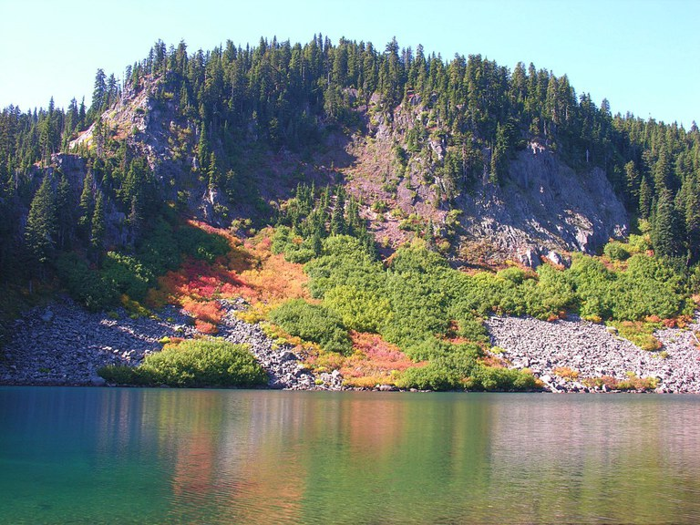
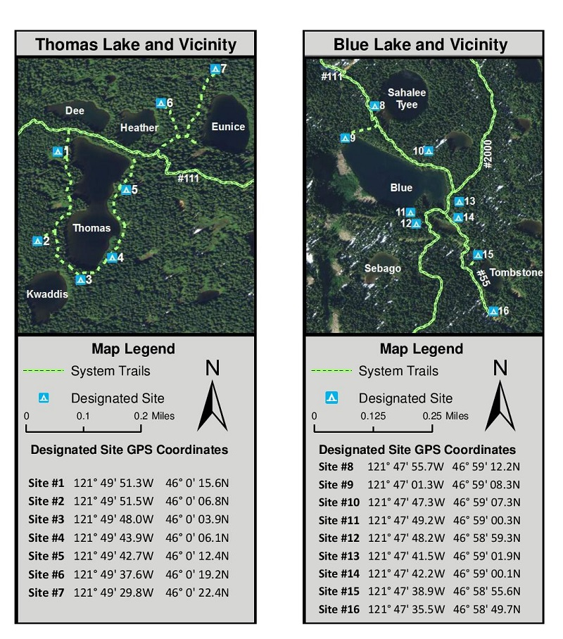

# Indian Heaven Wilderness 2023

| | |
| :-- | :-- |
| Destination | Blue Lake (Indian Heaven Wilderness) via Thomas Lake trail. |
| Trailhead | Thomas Lake Trailhead. **Meet at TH @ 12PM**|
| Days | One night, two days. |
| Day 1 | 3.5 mile hike to Blue Lake (or Tombstone lake, etc). Elevation gain 1000 ft.  Optional day hike.|
| Day 2 | 3.5 mile hike out. |
| Dates | Saturday, October 7th to Sunday, October 8th |
| Parking pass | Northwest Forest Pass |
| Permit | No permit required; self register at trail head, NOT a blue lake trail head. |

## Links
WTA - [Blue Lake / Thomas Lake](https://www.wta.org/go-hiking/hikes/thomas-lake-1)
- Remember that there are over 10 "Blue Lakes" in Washington.  This is the one in Indian Heaven Wilderness.  Blue lake used to have a 1.5 mile access through a CLOSED ROAD.  Make sure you get directions to the Thomas Lake Trailhead.

## Location
Blue Lake is located on the south side of the Indian Heaven Wilderness on the pacific crest trail.

## Gear
There is no shared gear list, but Bree, I am happy to bring one set of stove stuff that I can carry.

## Food
For group food Jonathan and Ashley will bring:
- Tortellini for dinner 
- A simple dessert
- Two cans of wine and 10oz whiskey
- Some extra trail snacks for the group (including nut and sweet snack for Alpen)

Each party is will figure out there own Breakfasts (including coffee etc.), lunch, and snacks.  Probably no lunch needed for hike out on Sunday.

## Sites
Picture below is pre scouted camp sites.  We are going to Blue Lake on the right and will walk past Thomas Lake (it's super close to the car).

## Notes
- I haven't done a lot of research, so reading over some trip reports and checking the above information would be helpful
- Looks like Saturday has the best weather for entire week!
- Group gear, how we do food, meet time, etc. can be discussed and if you have a preference, lets do it.
- Let's go!