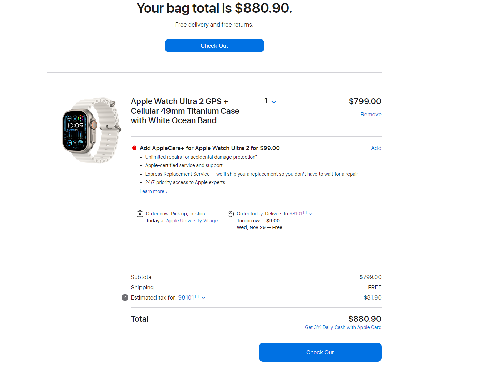
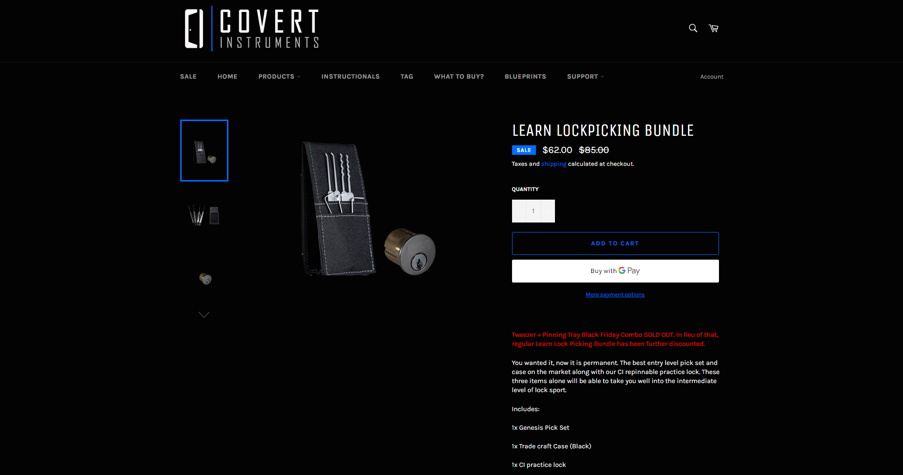
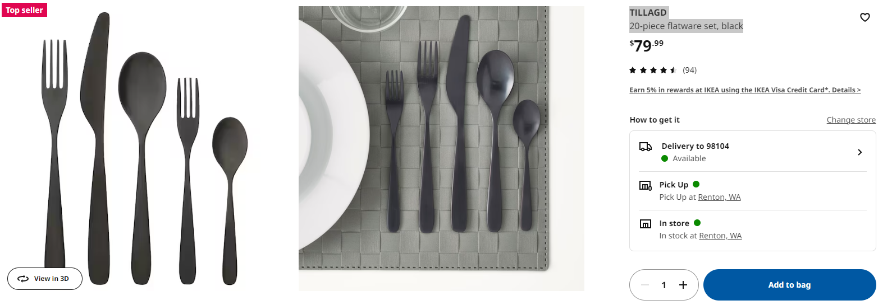
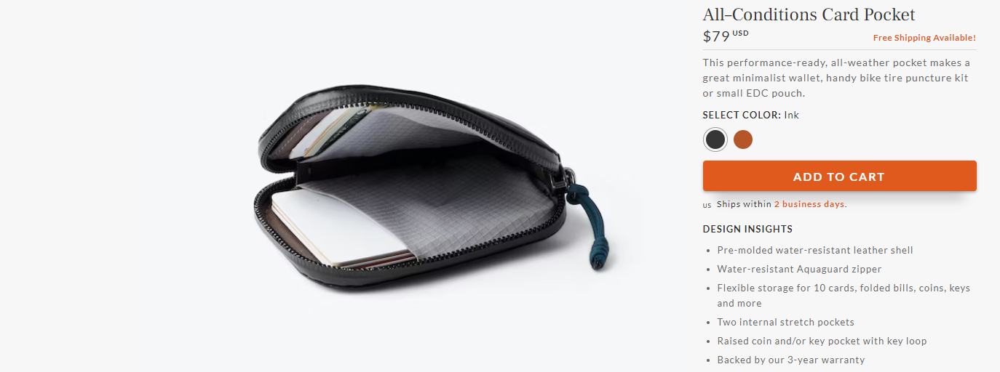
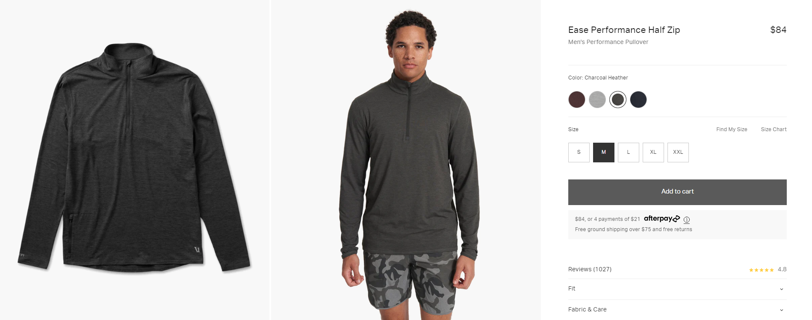
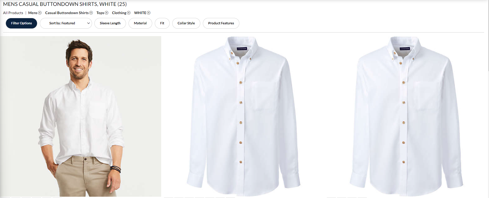
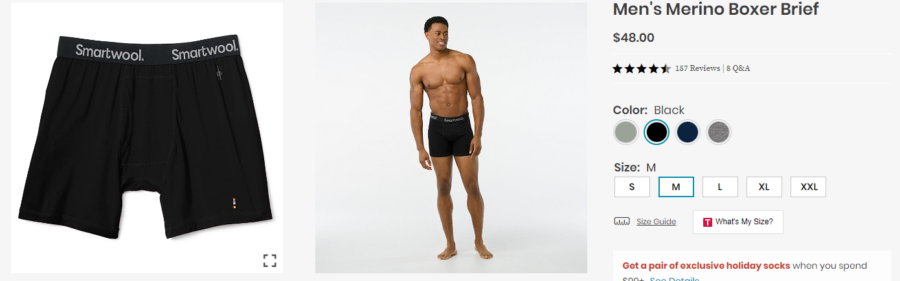
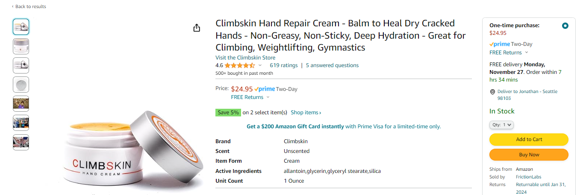
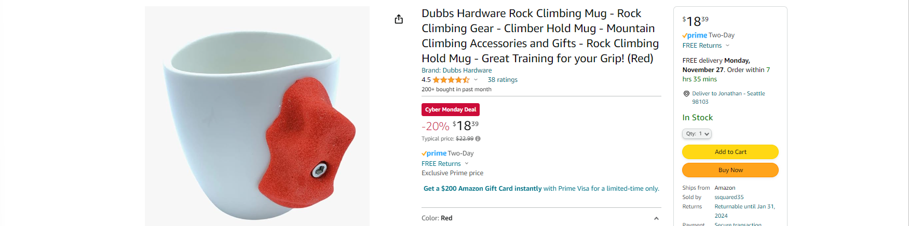
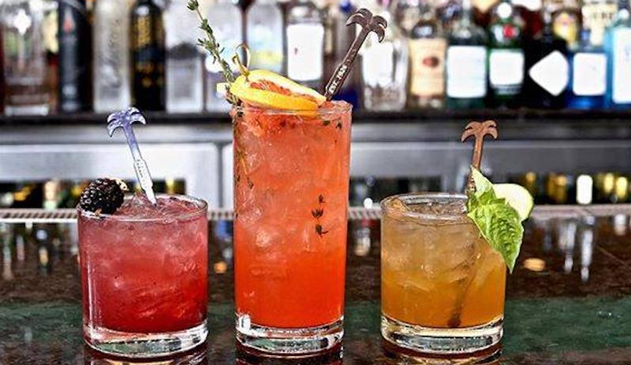

# Jonathan Christmas 2023
As always, for me, I don't need the items on my list and deviating from the list is fine (I don't need outdoor items and I don't need other clothing).

The one item I want for sure is the [LEARN LOCKPICKING BUNDLE](https://covertinstruments.com/collections/training-gear/products/learn-lockpicking-bundle).

## A big gift...
### Apple Watch Ulta 2

 After researching over the last month and consulting with many friends, I've decided I want 
 an Apple Ultra 2 watch. It serves as a phone replacement and is the ultimate outdoor watch. If it were under the tree for Christmas, I would like to pay for half of it (and would prefer it to something like cash so I can play with it on Christmas--I can even get cash on Christmas).  I am fine with this NOT being underneath the tree.

Only the Apple Watch Ultra 2 that meets my needs that meets my needs, as it has a larger battery, making it work for an entire day away from the phone. The Ultra has some different hardware a minimally bigger screen (4mm larger, which I wish were a bit smaller), but its doubled battery life allows it to function independent of an iPhone for the day.

The watch features an incredibly scratch-resistant sapphire crystal display. I've seen numerous YouTube videos where people attempt to damage the screen. While it can get minor scratches, in most tests, the internal hardware and titanium outer shell break before a scratch on the screen! The cost of the Series 9 Apple Watch jumps from $400 to $700 when you opt for the sapphire crystal screen, making the Ultra a hundred dollars more than the Series 9 model.  While one worries about phones breaking outside, the Apple Watch Ultra was intended for outdoor recreation.

Some of the outdoor features of the Ultra watch include:

- GPS, compass, barometer, and altimeter.
  - Upgraded precision dual-frequency GPS for better tracking in heavy tree cover and canyon-like outdoor environments.
- Fitness tracking, including steps, heart rate, miles traveled/pacing, and activity-based calorie burn.
- Emergency features like texting, phone calls, location services, fall detection, and emergency SOS (can be used for scenarios like independent trail running or biking where a fall might occur, but intended for elderly).
- Recreational dive watch capabilities and suitability for high-speed water sports.
- Ability to download and use maps offline.
- Weather updates.
- Battery management features to extend battery life.
- Other outdoor apps.

It is ultimate outdoor and fitness electronic device (who would have thought Apple would be in this market for climbers and rafters), and I want to use it to potentially replace a phone. While I don't need to sell my phone, I'm eager to try living without it and, ideally, avoid having to repurchase one.

## Puzzles / Activities for Christas Day
### Covert instruments learn to lock pick set

Link: [LEARN LOCKPICKING BUNDLE](https://covertinstruments.com/collections/training-gear/products/learn-lockpicking-bundle)

I have watched over 50 videos by the lock picking lawyer on youtube and lock picking turns out to be a 'fun sport', and something that can be done as someone watches TV or another activity.  This is a basic starter set as it contains the genesis set (basic pick tools) and a CI practice lock (the practice lock is actually six different locks that get more difficult). Others have found lock picking to be rather intriguing and relaxing puzzle solving activity.

If it's available, the FNG for under 10 dollars would be a a replacement, but it doesn't actually teach you lock picking as the lock is an example of how locks work, not actual 'practice lock.'  I think I also could get by with just the genesis set and no practice lock.

## Home / kitchen
### TILLAGD 20-piece flatware set, black

Link: [TILLAGD 20-piece flatware set, black](https://www.ikea.com/us/en/p/tillagd-20-piece-flatware-set-black-80424934/)

I have this set and it's great.  I like the black color and the weight of the utensils.  I have 2 sets of these, so I have 8 of each utensil, but Ashley and I have found that having 12 of each would be nice because we keep running out of large forks and spoons.

Please only get this exact item as to match the set we already have.

## Clothing
Please only clothing that I request as I am not adding a new item to my wardrobe unless it's replacing something I already have.

### All–Conditions Card Pocket

My current wallet does not need replacing, yet, but I would like to downsize.  It's approach is creating a hard case and using elastic to hold the items and not individually separating each item with leather to keep it small. 

This wallet has the advantage of attaching my keys to it, of which I want to carry some on the outside and other keys on the inside (I want a solution to combine my keys and wallet into one item).  It still has an option for carrying coins. Water proof / resistant. Fits in any pocket. High quality.

I think this is super cool and it's going with a minimalist /EDC trend: how can I reduce the number of items and size of items I carry every day while still carrying the same functionality.  I've done a lot of research on wallets and landed on this one.

### Ease Performance Half Zip

Link: [Ease Performance Half Zip](https://vuoriclothing.com/products/ease-performance-half-zip-charcoal-heather?queryId=7eea00876f1ce87010f420dc7e7eb2ba&objectId=22965094318138)

I received this item last year for Christmas and I love it as I can put of over my white button down and wear it to work.  I would like another one in a different color--so not blue.  I like the charcoal heather color. Size medium or large.

This is replacing a lighter weight pull over that is too small and has not held up.

I don't need two vuori items, but a second item that caught my eye was [Long Sleeve Strato Tech Tee](https://vuoriclothing.com/products/long-sleeve-strato-tech-tee-black?queryId=e3036de7d37954b405313374720c8127) IN BLACK if the above item was sold out etc.

### One Lands End large white fitted no iron button down shirt

Description is *one Lands End large white fitted no iron button down shirt.*

I wear a white button down shirt to work every day.  I have 5 of these shirts and I would like to replace one that is getting old.

### Smart wool underwear

Link: [Men's Merino Boxer Brief](hhttps://www.smartwool.com/shop/mens-underwear/mens-merino-boxer-brief-sw016997?variationId=001)

Merino wool underwear is amazing and not something I purchase for myself.  I linked to a smart boxer brief pair that I liked, but I am open to other brands and types.  I currently have 3 pairs of merino wool underwear which is enough for all of my outdoor / running pursuits...this isn't needed, but I love um.

## Outdoor / Climbing / Smaller gifts
These are interesting smaller items that I thought about trying, but have never purchased.  These items are mostly to have some lower cost 

### Climbing skin Hand Repair Cream 

Link: [Climbing skin Hand Repair Cream](https://www.amazon.com/Climbskin-Hand-Cream-Protect-Regenerate/dp/B00HNA2YW2/ref=sr_1_51_sspa?hvadid=616989150413&hvdev=c&hvlocphy=9033316&hvnetw=g&hvqmt=e&hvrand=3056636224605724516&hvtargid=kwd-17671073650&hydadcr=15280_13597137&keywords=gifts+for+rock+climbers&qid=1700958322&sr=8-51-spons&sp_csd=d2lkZ2V0TmFtZT1zcF9idGY&psc=1)

I have been wanting to try a hand repair cream for a while.  I have never tried this one, but I have heard good things about this one.  I'm open to trying any hand repair cream that someone has been well reviewed.

### Climbing mug 

Links: NONE

I have been thinking about getting a glass for liquids for work and one with a climbing hold is a cute idea.

### Your favorite cocktail mixer and garnish

If you have a favorite interesting cocktail you want me to make for you that includes scotch, gin, whisky, or rum, I would like to make it for you.  Simply provide any mixers and garnishes.

