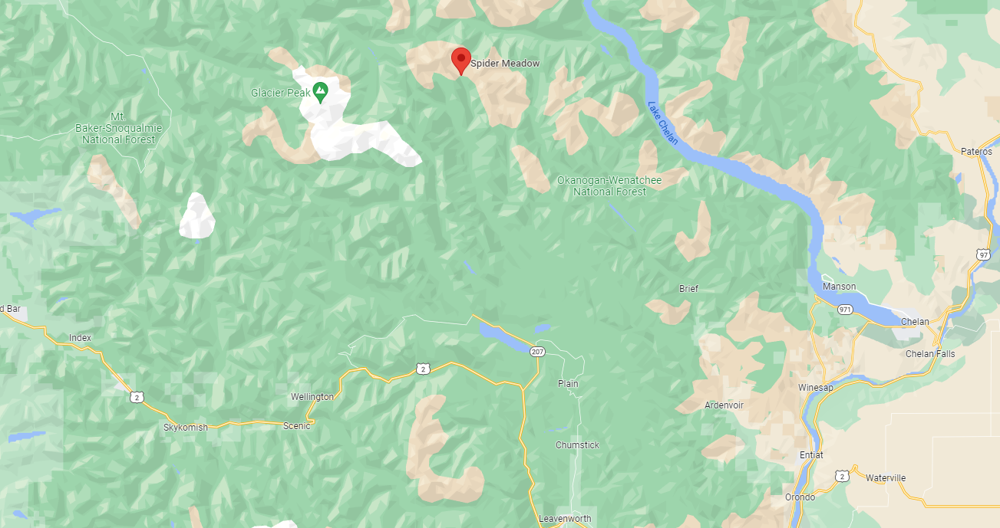
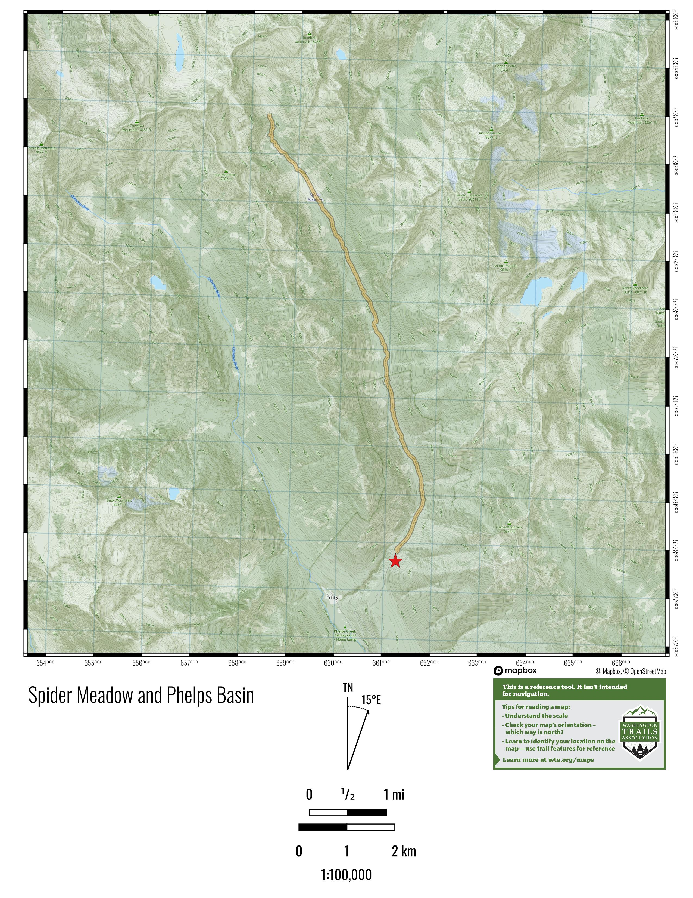
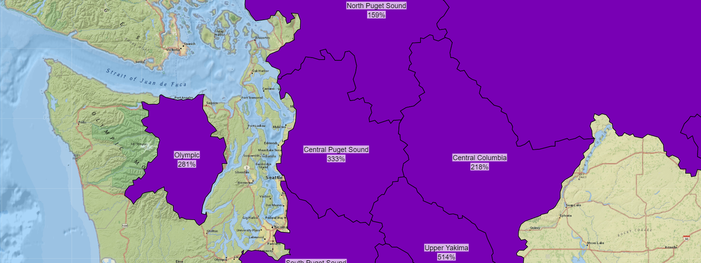

# Spider Meadows 2022
*Site is public. Links password protected.*

## Links
- Excel: [Gear, itinerary, questions ](https://buchnerfamilycom.sharepoint.com/:x:/g/EZtADW1tT4dJjRaDqz5IcWQBX3YYAoHHYcDG1HGbHLTVbQ?e=7Mk53N)
- Word: [Outfitter questions](https://buchnerfamilycom.sharepoint.com/:w:/g/ESuTTEixMvRCmY3jBDCQCxYBVd54Vm6Ji26DyNGuCKnhQw?e=6Vuypq)
- WTA:  [Spider Meadows / Phelps Basin](https://www.wta.org/go-hiking/hikes/spider-meadows)

## Location
Spider Meadows is located above Highway 2 and east of Glacier Peak.

## Gear
Above is excel file with two gear sheets.  **Anyone can add additional items/rows and comments**.  *Please don't delete rows.* [Gear, itinerary, questions](https://buchnerfamilycom.sharepoint.com/:x:/g/EZtADW1tT4dJjRaDqz5IcWQBX3YYAoHHYcDG1HGbHLTVbQ?e=7Mk53N).
### Group Gear
The *Group Gear* sheet is for anyone to mark they are bringing an item that they are willing to share.  Its simpler and easier if don't have five big first aid kits, five stoves, and five water pumps.  If you promise to bring, don't forget!

### Individual Gear List
The *Individual Gear* sheet lists items someone **may** want to bring. Helpful if you haven't overnight backpacked recently. 

## Outfitter Coordinating
Above is a word document with questions for the outfitter.
[Outfitter questions](https://buchnerfamilycom.sharepoint.com/:w:/g/ESuTTEixMvRCmY3jBDCQCxYBVd54Vm6Ji26DyNGuCKnhQw?e=6Vuypq).

## Itinerary
*Coming Soon.* In the shared excel file is a shortened itinerary sheet to help:
- Confirm coordination with outfitters. 
- Help choose between overnighting and car camping.
  - E.g. on Tuesday, overnighters will probably wait for the outfitters to arrive, hike back to the car, and then travel home which may make it into a late evening.
- Make sure if there are non-overnighters everyone will connect at the right time on Monday.

##  Drive
Phelps Creek Trailhead is 3.5h to 4h drive [from Seattle](https://www.google.com/maps/dir/Columbia+City,+Seattle,+WA/Phelps+Creek+Trailhead,+Forest+Road+6200,+Leavenworth,+WA+98826/@47.6254291,-122.5582082,8z/data=!3m1!4b1!4m18!4m17!1m5!1m1!1s0x54906a0c5aa68bb1:0xfa602b48f2068cf8!2m2!1d-122.2869617!2d47.5607961!1m5!1m1!1s0x549b3d4d88aec98d:0x9f81bfbd3b7ab146!2m2!1d-120.835!2d48.0832!2m3!6e0!7e2!8j1655033700!3e0) and a 6h to 7.5h drive [from Portland](https://www.google.com/maps/dir/Portland,+OR/Phelps+Creek+Trailhead,+Forest+Road+6200,+Leavenworth,+WA+98826/@46.7809729,-123.9126411,7z/data=!3m1!4b1!4m18!4m17!1m5!1m1!1s0x54950b0b7da97427:0x1c36b9e6f6d18591!2m2!1d-122.6783853!2d45.515232!1m5!1m1!1s0x549b3d4d88aec98d:0x9f81bfbd3b7ab146!2m2!1d-120.835!2d48.0832!2m3!6e0!7e2!8j1655033700!3e0).  You turn off Highway 2 at Coles Corner onto 207 North (Lake Wenatchee Highway).
- After the Wenatchee River bridge, slight right onto Chiwawa Loop Road (1.3 mi)
- Turn left onto Chiwawa River Rd (22.1 mi). **More than ten miles is a slow dirt road.  No low clearance cars**
- Slight right onto Phelps Creek Forest Service 6211 Rd/Phelps Creek Trailhead Rd (2.4 mi)

### Trailhead
_**No** NW Forest Pass required._ (double check?) Passes are required at trailheads adjacent to U.S. Forest Service land with trails leading into the national parks.  No pass listed as required.  I believe no water nor bathroom at trailhead.

## Trail
Starting at 3500ft you leave the Phelps Creek Trailhead and walk on the right of Phelps Creek for a gradual 5.5 mile walk to a meadow opening below 4800ft.  The trail continues up the basin through Spider Pass (5300ft).  There are several creeks to cross with the largest being Leroy creek which is a delicate crossing without waterproof boots.  

Purchase Green Trail Maps - [Holden, WA No. 113](https://www.mountaineers.org/books/books/holden-wa-no-113-green-trails-maps). 

Spider Meadows Map - *open the below picture in another tab to zoom in*

## Camping

### Party size
Max party size is 12.  Buchner + Lovell + Henjum is at 11. 

### Sites
Crowded area, many camps, which fill up on Fri/Sat.  All our tents may not fit right next to each other.  There are outdoor toilets (need own TP, some prefer to dig). Mix of sun, shade, and stock site options.

### Bugs
Even with the snow recently melted be ready with clothing to completely cover and prevent yourself from being bit, *especially for kids.*  

## Food
As of 6/13 all parties are recommended to figure out there own snacks, drinks, breakfast, and lunches.  Jonathan is happy to organize bringing gnocchi (fried) and tortellini (a Derek backpacking favorite) if we want to organize a group dinner.

## Bears & Rodents
Food will need to be hung or in bear canisters, including to protect against marmots & mice.  We have plenty of canisters + hang options / no need to purchase.

## Weather
### Snow
It's still snowing on occasion at 5000ft and the snowpack is 200% more than usual across WA (6/13/22, see purple below).  On 6/13/22 there was about two feet of snow at Steven's Pass at 4000ft and we will be just below 5000ft.  Best guesses are difficult snow crossings to get to Spider Pass in mid-July (above us), but that we will only cross intermittent snow and no snow on campsites by mid July.  

### Rain
If rain, Jonathan will bring at least one 10 by 14ft shelter to eat / play under. There will be dry cook and play space.  Everyone would need rain gear, consider rain pant option as high meadow grass can soak legs & socks, especially for kidos.
- [National Weather Service forecast](https://forecast.weather.gov/MapClick.php?lon=-120.8502960205078&lat=48.13907212866508#.YqfM4XbMISE) for -120.8502960205078 & 8.13907212866508

## Questions
Ask them all.  Some have been to the area recently, others have not. [Gear & Itenery & Questions](https://buchnerfamilycom.sharepoint.com/:x:/g/EZtADW1tT4dJjRaDqz5IcWQBX3YYAoHHYcDG1HGbHLTVbQ?e=7Mk53N)

## Fun facts
- Derek was younger than Alpen on his first trip to Spider Meadows.
- On the other side of Spider Pass is Lyman Glacier, named after the same professor that Jonathan's freshmen year dorm was named after.
- David wrote an introduction to a reprinted version of 100 Hikes Glacier Peak Region by Ira Springs & Harvey Manning.  Before the internets this was the guidebook for visiting Spider Meadows.

## Derek Event
I imagine there will be an opportunity for everyone to speak, but if you discover you have an idea or preference for Monday to work a certain way, share it with Bree and others! 