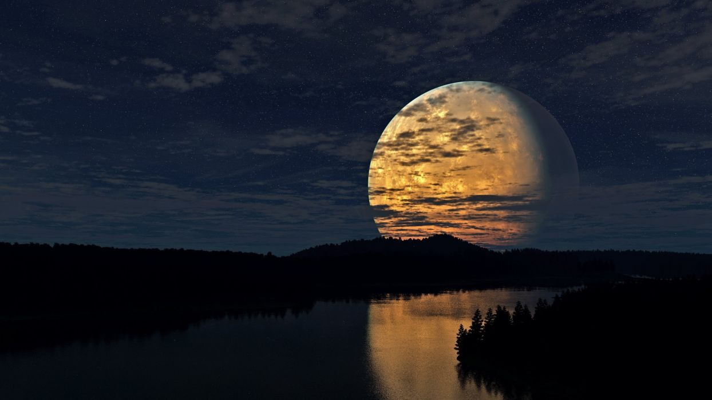
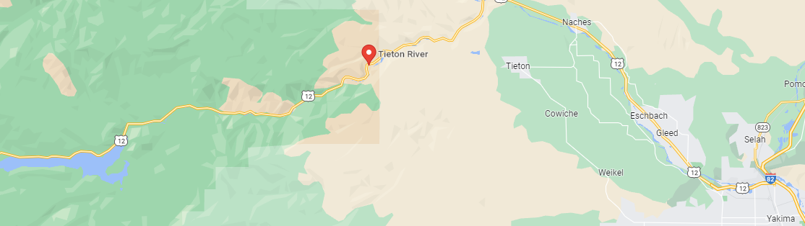

# Tieton Moon Party
This is different trip from the annual guide party.  It's a moon party!  The next full moon is Friday, September 9th and it will be the harvest moon.

Fill out the excel sheet to let us know you are coming and what you may bring:

## Dates
**10/10/22 - 10/11/22**  - Saturday& Sunday

Optionally stay Friday night.  I will trying to nag us a good spot.  Rafting is on Saturday. Sunday is an unknown but I want to get back out on the river.  *The moon party is Saturday night.*

## Where?
Tieton.  Camping is probably [South Fork Tieton Dispersed Camping](https://goo.gl/maps/wPCtxpWSKfJeWwqn9).

## What's a Moon Party?
We are going first to raft. 

But similer to moon waning, our rivers now have less and less water until the snow and rain fall later this year.  

If you are staying the night be prepared to purge something in the fire.  This may as simple as writing something you want to let go of on a piece of paper and throwing it in the fire.  Again the moon is waning and you too should let go of something.

You may wear a token to moon's brightness through a glow stick, glow in the dark face paint, or glow glitter.  This will be available.

Anyone can bring anything else they feel a moon party needs.  A lot of moon parties are all about tarot card readings, crystals, or candles...and if you want that, you do you and you are supported!

Expect a chill, camp fire vibe, rather than a bumping party ;).  But got to theme it and who knows!

## Who is invited?
Anyone who is a friends with us (our guide class + our invites, etc.)--especially if they rafted with us this year!  Maybe it will be like four of us, maybe it will be like sixteen of us, let's make it a party! *Not prepared for more than like 20?*

Please help coordinate through the excel sheet, especially to make sure we have enough spots in rafts.  **We are trying to count the amount of rafts we will have.**

## Activities
On Saturday **raft** and **camp** (and maybe **climb**).  Links:
- American Whitewater: [Rimrock Reservoir to Windy Point Campground (Upper)](https://www.americanwhitewater.org/content/River/view/river-detail/2249/main)
- American Whitewater: [Windy Point Campground to Naches (Lower)](https://www.americanwhitewater.org/content/River/view/river-detail/2250/main)
- The Crag: [Climbing Tieton River Canyon](https://www.thecrag.com/en/climbing/united-states/tieton-river-canyon)
- Falcon: [Rock Climbing Washington](https://www.amazon.com/gp/product/1493039415/ref=ppx_yo_dt_b_asin_image_o00_s00?ie=UTF8&psc=1) (book)

## Dinner
Let's all contribute to fayettas. Jonathan will bring chicken, wraps, cheese, salsa.  We can coordinate on the excel sheet.   Everyone bring there own drinks and optionally extra.

## Needs

### Jonathan will probably bring enough
- Glow sticks everything
- Some face/body paint - *Probably enough for faces and arms, not like enought to paint your body*
- We will try glow in the dark glitter
- Two black lights (if we can find power)
- Fire pan

### Don't have
- More wood
- Instruments
- Music
