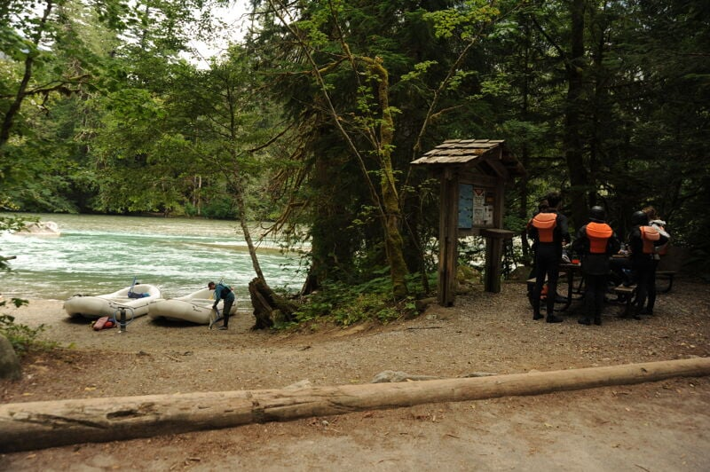

# Skagit River
Information | Details
| :-- | :-- |
Date | Saturday, 7/8/2023
Meet Time | 8:45am (Ready to leave Park-and-Ride at 9AM)
Meet Place | [Ash Way Park-and-Ride Lost](https://www.soundtransit.org/ride-with-us/parking/snohomish-county/ash-way-park-ride-lot) 
River | Skagit
River Location | The Skagit river runs along highway 20 in the North Cascades.
Section | [Section 2: Goodell Creek to Copper Creek](https://www.americanwhitewater.org/content/River/view/river-detail/2206/main)
Length | 8.5 miles (2+ hours)
Gear list | [Recommended Gear](https://github.com/JonathanBuchner/plan/blob/main/rafting/river-gear.md)
Food list | Bring a snack and drinks (alcohol and water)

## Details
### Where are we going? 
The Skagit river runs along highway 20 in the North Cascades.  The put in is beneath newhalem dam.  Above the dam is Ross Lake.

### Meet up
We will meet at Ash Way Park-and-Ride lot which is just north of where I405 connects to I5 and jump into two cars.  Best to have all the coffee, food, and drinks before you arrive.  Text the group if you need for us to stop. (I recommend this [Safe Way](https://local.safeway.com/safeway/wa/everett/520-128th-st-sw.html?utm_source=G&utm_medium=Maps&utm_campaign=G+Places).  Starbucks is accross the streat).  

**I would like to scout the S Bends rapid between mile 114.1 (upstream end and start of rapid) or mile 113.5 (downstream end) before we jump on the river.  We will also scout the take out as a group.**

### Put In 
*Putin Goodell Creek Campground at mile 119.4 on Highway 20. There is a boat launch and information sign at the downstream end of the campground. A small beach and unload area provides a place for staging and is convenient for rafts. Ample parking is on the street adjacent to the launch area. Be sure to leave room for rafters to access the launch by parking cars outside the campground on the dirt road. For those who are curious as to what lies upstream, the parking area for the Gorge Powerhouse is at Highway 20 mile 120.9 but there is no formal river access.*

### Ride
Early on there is a small rapid called Goodell.  Afterwards you reach S Bends rapid, which is a series of three rapids and their size is based on flow. There is a small hole int the middle of the river towards the bottom.

Otherwise, this is a scenice relaxing run.  Bring drinks.

### Take Out
Takeout At mile 111.7 on Highway 20 there is a dirt road (NPS Road 213) leading south to the river (it's just before you reach the Ross Lake Recreation Area sign). Follow the dirt road and take the left fork to a takeout about 200 yards from the highway. Parking options are limited here.  Remi
